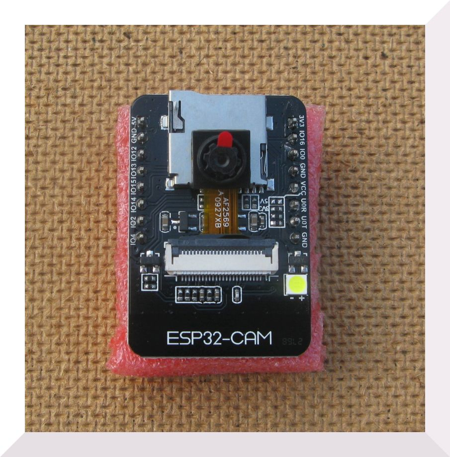

#ESP32CAM as Balloon Tracker - Really?

The ESP32CAM is a small and low cost board that contains an ESP32, a OV2640 2.0 MP mega pixels camera and a microSD card socket.

There is a standard bit of software that will take a picture and store it on the microSD card as a JPG. 

 

OK, so the pictures are not brilliant, but then the board is quite small and cheap, but maybe I already mentioned that. 

Now if you could attach a GPS and a LoRa device you would have a real cheap board that could act as a high altitude balloon tracker. 

Unfortunately the IO pins provided on the ESP32CAM are also used for the SD card, so getting a LoRa device and GPS working is not straight forward. 

First I breadboarded the device, and to make life easy for debugging I added a wire to the reset switch so I could connect that externally, the boot pin (that needs to be held low for programming) was already available on the pin headers. I also connected a wire to the output of the on board red LED (pin33) this pin could then be used for a debugging serial output if the GPS was on the serial program upload port. 

Next I built up a prototype on stripboard and first checked that my ESP32CAM was working and could take a picture and store it on SD, it was.  

I took the basic ESP32CAM program and added the setup of an SX1278 LoRa device after the camera had take a picture. If this could be made to work I would at least be able to be notified (via LoRa) that a remote ESP32CAM had taken a picture. 

After a bit of juggling with pins I had a working set-up, although there was not a spare pin to drive the LoRa device NRESET, not to much of a problem, I have left it disconnected on other set-ups and the LoRa device seems happy to be reliable without needing to be reset. 

The basic working set-up was;

- Wake from sleep
- Print information on bootcount etc
- Initialise the Camera
- Initialise the SD card
- Take a picture, stored on SD card
- Initialise the SPI interface
- Initialise the LoRa device
- Build a HAB style packet
- Transmit the packet with LoRa
- Put board to sleep for X seconds

And this works fine. Its necessary to reset the ESP32 since with the SPI interface enabled for the LoRa device the SD card wont initialise and vice versa. 

It would be handy to have a LED to indicate progress and errors so I attached one to the NSS pin of the LoRa device so the LED would be ON when NSS was low. I Added software to blink the LED a set number of times at each stage in the program, once at wakeup, twice at camera init etc. If there was an error at stage then there was first a short burst of fast LED flashes. 

(and yes I know the ESP32CAM already has an LED on pin 33)

So you can get the ESP32CAM to take a picture and use a LoRa device at the same time. There is a potential application here, use the ESP32CAM as a some form of monitoring camera with the ability to down load pictures over long distances. But even here there is a problem. At 434Mhz we are normally restricted to a duty cycle of 10%, since for the average SX1278 LoRa device you need to operate at a bandwidth of 62.5Khz or more. If you could operate at the 20.8Khz LoRa bandwith then 100% duty cycle is allowed (at least it is in the UK). Operating standard SX1278 LoRa devices at 20.8Khz involves manual tuning adjustments and it may be that you cannot get communications running at all, so not good or reliable. However the SX12XX library we are using here supports the SX126X devices from the likes of NiceRF and Dorji, these have TCXOs and are quite happy to work at 20.8khz (or lower) with no manual tuning needed. The SX126X device needs an extra pin, RFBUSY, and we are already short on pins. The flash LED pin (4) is not really needed so we can connect that to RFBUSY as an input, but does it work ?

It takes only a few seconds to convert the SX127X program accross to SX126X, and this program works too. With RFBUSY bieng operable, we can also use the SX1280 2.4Ghz LoRa devices, so fast downloads of pictures with no duty cycle issues would be possible. 

Using pin 4 for RFBUSY does make the pin 4 white 'Flash' annoying so I removed driver transistor (S8050) that is next to the LED.      

Then we come to the GPS, there is no reason why you cannot run that on the serial programming port but then you loose the ability to send debug messages to the Arduino serial monitor. So I connected a wire to the output of the on board red LED (pin 33), this pin was then used for a debugging serial output on Serial2. 

By initialising the LoRa device first, then the SD card and camera you could get all 3 device working. Thus if you could get a GPS working as well, there was the basis for a tracker application.

The circuit was first tested on breadboard, it took a while to find a working set of pins to allow the LoRa device to work. Then I made stripboard version. 

There are notionally some ‘spare’ pins so I did wonder if you could persuade the board to run a LoRa device and a GPS.

Its not straight forward but it turns out you can. After a fair bit of testing and rationalising and making do, you can have a LoRa tracker that will read a the battery voltage, take temperature, hummidity and pressure from a BME280 sensor, read the position from a GPS, take a picture, store it on MicroSD, transmit a standard LoRa HAB payload, the same payload as FSK RTTY and print diagnostic messages to the Serial Monitor. You can even squueze a FRAM in for saving stuff in non-volatile storage to avoid using the ESP32 Flash emulated as EEPROM. 

As for LoRa devices you can use the SX127X series, the SX126X series for super stable frequency operation or the SX128x 2.4Ghz LoRa device. Gettin the SX126X and SX128X working was a surprise as you need a extra IO pin to read the RFBUSY pin.  
